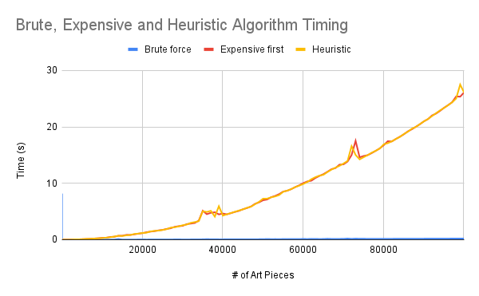
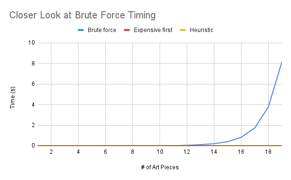
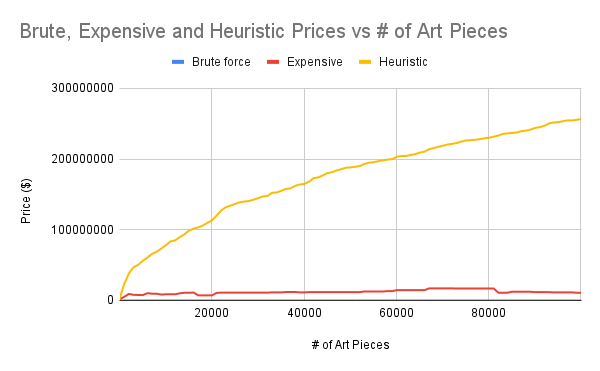
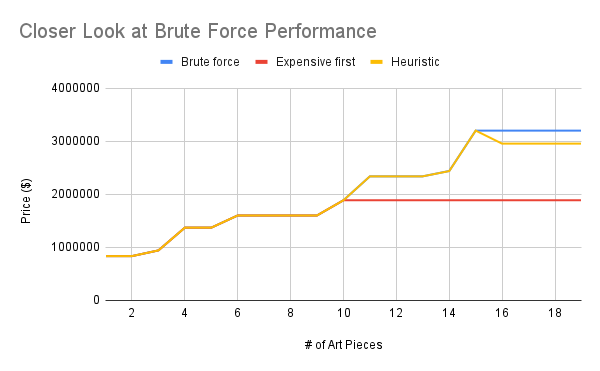

# 🖼Art is Fun!

Art is Fun! is a C++ project that calculates the most valuable collection of paintings that will fit along a centered position on a wall. This is achieved by use of 3 different algorithms: brute force (finding all possible subsets and selecting the most valuable one), most expensive first (sorting the art pieces by their price and putting them on the wall from highest to lowest), and a heuristic algorithm, which in this case orders art pieces by how valuable they are (price divided by width).

## Installation

This project can be run in the commandline via g++, or by compiling in CLion using the CMakeLists.txt file with your chosen compiler. Below I will show you how to install g++. 

First, check if g++ is installed. 
```bash
$ g++ --version
```
If it is not installed, install it. 
```bash
$ sudo apt-get install g++
```

## Usage

First, navigate to the project directory.
```bash
$ cd FullFilePathHere
```
Next, compile all of the relevant files using g++
```bash
$ g++ src/main.cpp src/Art.cpp src/Wall.cpp src/DSLinkedList.h src/Museum.cpp src/Algorithm.cpp
```
Run the program, this program takes one command line argument: the list of art pieces
```bash
$ ./a.out data/inputFileHere.txt
```

The Input file has to be formatted in the following manner, note that every value 
is an integer:
```text
<width> <height>
<amount of art pieces following>
<id> <price> <width> <height>
etc.
```
example:
```text
1023 1500
2
1 234 523 1234
2 584 754 438
```

##Algorithm Analysis
When discussing each of the 3 algorithms used in this 
project, speed and accuracy are the two primary variables we focused on.

###Speed
Here is the graph showing how the speed of each respective algorithm 
as the number of art pieces increases:



The first thing you might notice in this graph is the state of the Brute force
algorithm. The reasoning for its running along the x-axis is due to its nature. 
As stated above, the nature of producing every subset of the set of art is highly 
inefficient and will grow scaling by a factorial. Later we will have a closer look 
at this algorithm.

Both the most expensive first and the custom heuristic algorithm grow practically
identically as the number of art pieces grows. This is due to both algorithms functioning
in close to the same way: by inserting the art into a set to pre-sort based on a value, then 
inserting them onto the wall in order until space runs out. The close equivalency
of these algorithms easily explain their proximity. While the brute force algorithm 
has a complexity of O(n), the heuristic and expensive have a complexity that resembles that of
O(n*log(n)).

While the most expensive first algorithm sorts the art based on price alone, our custom 
heuristic algorithm uses the ratio between price and width. This instead places the art pieces with 
the most amount of value per unit of width first which, as well soon see, leads to more accurate results.

Next we'll take a closer look at the Brute force graph.

It is quite clear that the brute force algorithm is not very well optimized for speed, but rather
for its accuracy, as it will always pick the most valuable set of pictures. However, due to the rate 
at which the time increases with just a small increase in size, this algorithm is quite inefficient in any
practical way in comparison to the other 2.

###Prices
Similar to timing, we will first look at all 3 algorithms before taking a closer look at 
brute force.

Here is the graph showing the total value of the wall after the art has been placed:


Unlike the graph for timing, all three algorithms vary quite a bit. The expensive first algorithm 
seemed to be consistent in the price of the wall, even as the dataset grew in size. The cause of this 
anomoly could be due to the chance that the most expensive art piece, might also be the largest art piece, 
leading it to consistently take up most of the wall space. As well see in the Heuristic, the most expensive art piece 
might not always be the most valuable in terms of value per unit of space on the wall. Although this algorithm
might be useful when used against smaller datasets, its effectiveness does seem to drop
quite a bit when faced with larger datasets.

The heuristic graph, on the other hand, shows a very likable graph in terms of accuracy. Although the accuracy might seem
close to the expensive algorithm with smaller sets, its very obvious that it improves very well. This can be explained 
though the fact that, with smaller sets, there are fewer choices of art pieces that can be chosen from, leading any
algorithm to perform similarly. However, the strength of this algorithm shows as the amount of art
grows. This algorithm will always choose the art with the best value per unit of space on the wall, allowing
it to be as efficient as possible when comparing value.

It is very clear that the custom heuristic is the most effective at producing the most valuable wall of art,
even as the amount of art to choose from gets larger. Although expensive first does seem like a good and simple 
choice when looking for the most value, the size of the art in comparison to the wall must also be taken into account.

Below is the graph for Brute force prices:

Although it might be expected to see brute force dominating the prices with the smaller data sets,
that is not the case. As I mentioned above, the smaller data sets also lead to less amount of choice
when it came to picking the art for the wall, leading to similar results for every algorithm.

###Conclusion
Although the Brute force algorithm might reign superior when wishing for an algorithm that 
consistently chooses the most valuable set of art every time, the extremely inefficient method of 
achieving this makes the algorithm very impractical. The other two algorithms, although similar in
speed, do have quite the difference when it came to the price the algorithm produced. This, ultimately makes the 
Heuristic algorithm, with the speed of the expensive first and the accuracy of the brute force, the most effective
algorithm.

## Credits
This project was completed entirely by Zach Suzuki and Daniel Ryan for CS3353, Fundamentals of Algorithms taught by Dr. Fontenot.
